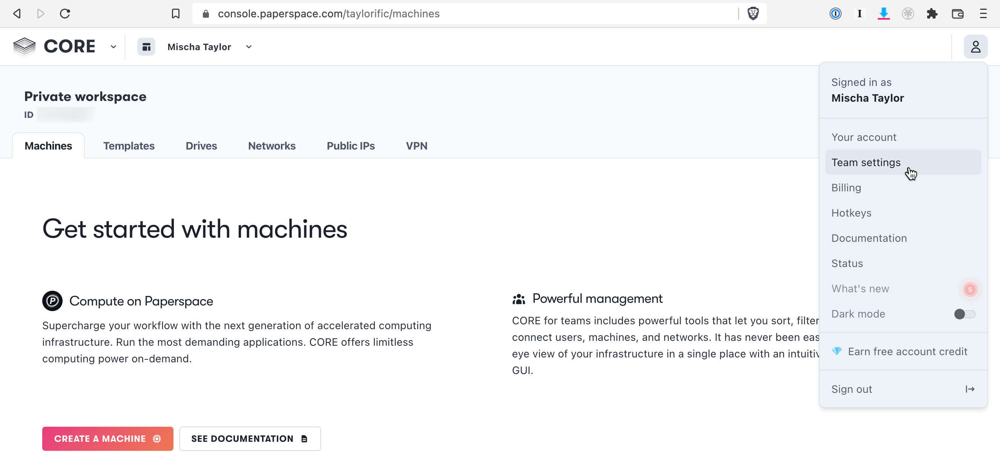
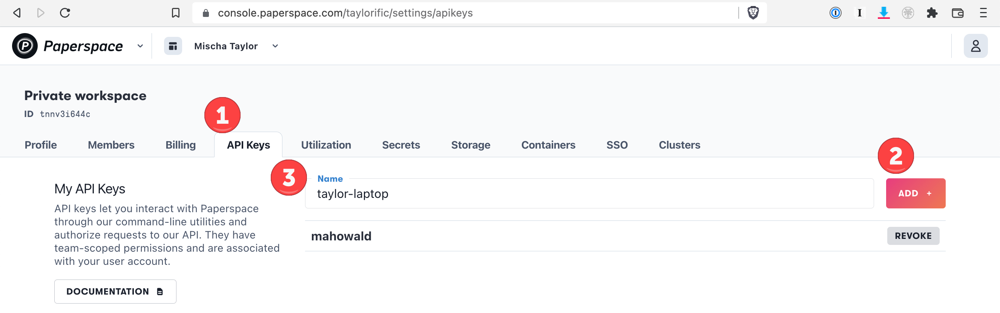

Getting a Paperspace API Key
============================
Login to Paperspace with your account via https://console.paperspace.com/login. It's up to you whether or not you want to log in with Google or use your email address. Either work just fine.

Under your user account, choose **Team Settings**.



This will display the **API Keys** tab in your private workspace.
1. Click on the **API Keys** tab.
2. Click on the **Add** button.
3. Enter in a name for your API Key. Suggestion is the form <username>-<machine> (e.g. `taylor-laptop`).
4. Copy the API key to your clipboard.


  
Export the API Key as the environment variable `PAPERSPACE_API_KEY` in your `~/.bashrc`. It is suggested that you used the `~/.bashrc.d` pattern to manage this environment variable.
  
```
# Add the following section to the end of your ~/.bashrc
...
for config in ~/.bashrc.d/*.bashrc; do
    source $config
done
unset config

# Create a ~/.bashrc.d directory
$ mkdir ~/.bashrc.d

# Create the following script:
$ tee ~/.bashrc.d/140.paperspace.sh<<EOF
#!/bin/bash

export PAPERSPACE_API_KEY=<your_api_key>
EOF
```
